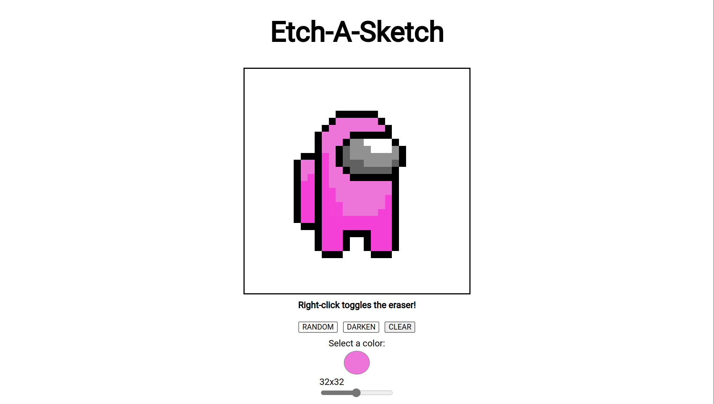

# Web Etch-A-Sketch: Digital Drawing Fun



Web Etch-A-Sketch brings the classic joy of doodling to your web browser. This web-based version of the beloved Etch-A-Sketch toy offers a creative platform for digital drawing, complete with some exciting features to enhance your artistic experience.

## Features

- **Drawing Canvas**: Unleash your creativity on the virtual canvas using your mouse. Draw intricate patterns, abstract designs, or anything you can imagine.

- **Random Color Generator**: Inject spontaneity into your drawings with a single click. The "Random Color" button generates vibrant and unexpected colors, making each stroke a surprise.

- **Color Darkener**: Add depth and dimension to your creations. The "Darken Color" button lets you create shadows and highlights by subtly adjusting the current color shade.

## Getting Started

### Online Demo

Experience Web Etch-A-Sketch directly in your browser by visiting our [online demo](https://suvansarkar.github.io/etch-a-sketch/). No installation required.

### Local Setup

1. Clone this repository to your local machine using:
    ```bash
    git clone https://github.com/Suvansarkar/etch-a-sketch.git
    ```

2. Navigate to the project directory:

    ```bash
    cd etch-a-sketch
    ```


3. Open `index.html` in your preferred web browser.

## Usage

- **Drawing**: Click and drag your mouse across the canvas to draw. Experiment with different strokes, shapes, and patterns.

- **Erasing**: Right click to toggle the eraser tool to wipe away any mistakes that have been made.

- **Random Color**: Inject spontaneity by clicking the "Random Color" button. Watch the color change and surprise yourself with unexpected combinations.

- **Color Darkener**: Create depth and shading effects with the "Darken Color" button. Adjust the darkness of the current color to achieve various shading effects.

- **Reset**: To start fresh, click the "Reset" button to clear the canvas and embark on a new artistic journey.

## Contributing

We welcome contributions to enhance Etch-A-Sketch! Feel free to submit bug reports, feature requests, or pull requests. Let's collaborate to make this project even more awesome.

## License

This project is licensed under the MIT License. See the [LICENSE](LICENSE) file for details.

## Acknowledgments

We extend our gratitude to the creators of the original Etch-A-Sketch toy for inspiring generations of creativity. Additionally, we are thankful to the open-source community for providing tools and resources that power this project.

Happy drawing and have fun exploring the endless possibilities of Etch-A-Sketch!

